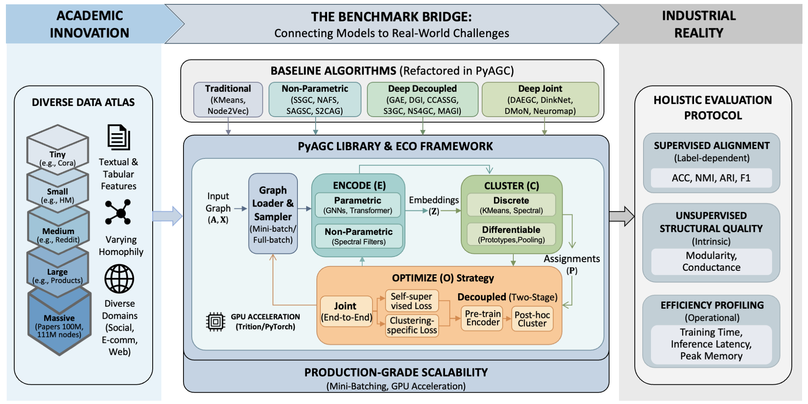

<div align="center">
  
  <h1>Bridging Academia and Industry for Attributed Graph Clustering</h1>
  <p>
    <a href="https://pypi.org/project/PyAGC"></a>
    <a href="https://pyagc.readthedocs.io"></a>
    <a href="https://github.com/Cloudy1225/PyAGC/blob/main/LICENSE"></a>
    <a href="https://github.com/Cloudy1225/PyAGC"></a>
  </p>
  <p>
    <a href="https://arxiv.org/abs/2602.08519"><strong>Paper</strong></a> | 
    <a href="https://pyagc.readthedocs.io"><strong>Documentation</strong></a> | 
    <a href="https://pypi.org/project/pyagc"><strong>PyPI</strong></a> | 
    <a href="benchmark/results/"><strong>Benchmark Results</strong></a>
  </p>
</div>

**PyAGC** is a production-ready, modular library and comprehensive benchmark for **Attributed Graph Clustering (AGC)**, built on [PyTorch](https://pytorch.org) and [PyTorch Geometric](https://www.pyg.org/). It unifies 20+ state-of-the-art algorithms under a principled **Encode-Cluster-Optimize (ECO)** framework, provides mini-batch implementations that scale to **111 million nodes** on a single 32GB GPU, and introduces a holistic evaluation protocol spanning supervised, unsupervised, and efficiency metrics across **12 diverse datasets**.

Battle-tested in high-stakes industrial workflows at **Ant Group** (Fraud Detection, Anti-Money Laundering, User Profiling), PyAGC offers the community a robust, reproducible, and scalable platform to advance AGC research towards realistic deployment.

<div align="center">
  
</div>

---

## Table of Contents

- [Why PyAGC?](#why-pyagc)
- [Key Features](#key-features)
- [Project Structure](#project-structure)
- [Installation](#installation)
- [Quick Start](#quick-start)
- [The ECO Framework](#the-eco-framework)
- [Benchmark](#benchmark)
  - [Datasets](#datasets)
  - [Algorithms](#algorithms)
  - [Evaluation Protocol](#evaluation-protocol)
  - [Benchmark Results](#benchmark-results)
  - [Reproducibility](#reproducibility)
- [Usage](#usage)
  - [Running Benchmarks](#running-benchmarks)
  - [Custom Experiments](#custom-experiments)
  - [Scaling to Large Graphs](#scaling-to-large-graphs)
- [Extending PyAGC](#extending-pyagc)
- [FAQ](#faq)
- [Citation](#citation)
- [Contributing](#contributing)
- [License](#license)
- [Acknowledgements](#acknowledgements)

---

## Why PyAGC?

Current AGC evaluation suffers from four critical limitations that PyAGC is designed to address:

| Problem | Status Quo | PyAGC Solution |
|:--|:--|:--|
| **The Cora-fication of Datasets** | Over-reliance on small, homophilous citation networks | 12 datasets spanning 5 orders of magnitude, including industrial graphs with tabular features and low homophily |
| **The Scalability Bottleneck** | Full-batch training limits methods to ~10⁵ nodes | Mini-batch implementations enabling training on 111M+ nodes with a single 32GB GPU |
| **The Supervised Metric Paradox** | Unsupervised methods evaluated only with supervised metrics | Holistic evaluation with unsupervised structural metrics (Modularity, Conductance) + efficiency profiling |
| **The Reproducibility Gap** | Scattered codebases with hard-coded parameters | Unified, configuration-driven framework with strict YAML-based experiment management |

---

## Key Features

- 📊 **Diverse Dataset Collection** — 12 graphs from 2.7K to 111M nodes across Citation, Social, E-commerce, and Web domains, featuring both textual and tabular attributes with varying homophily levels.

- 🧩 **Unified Algorithm Framework** — 20+ SOTA methods organized under the Encode-Cluster-Optimize taxonomy with modular, interchangeable encoders, cluster heads, and optimization strategies.

- 📏 **Holistic Evaluation Protocol** — Supervised metrics (ACC, NMI, ARI, F1), unsupervised structural metrics (Modularity, Conductance), and comprehensive efficiency profiling (time, memory).

- 🚀 **Production-Grade Scalability** — GPU-accelerated KMeans (via PyTorch + Triton) and neighbor-sampling-based mini-batch training that scales deep clustering to 111M nodes on a single 32GB V100 GPU.

- 🛠️ **Developer-Friendly Design** — Plug-and-play components, YAML-driven configuration, and clean abstractions that make prototyping new methods as easy as swapping a single config line.

---

## Project Structure

```
PyAGC/
├── pyagc/                          # Core library
│   ├── encoders/                   # GNN backbones (GCN, GAT, SAGE, GIN, Transformers)
│   ├── clusters/                   # Cluster heads (KMeans, DEC, DMoN, MinCut, Neuromap, ...)
│   ├── models/                     # Full model implementations (20+ methods)
│   ├── data/                       # Unified dataset loaders
│   ├── metrics/                    # Supervised + unsupervised metrics
│   ├── transforms/                 # Graph augmentations (edge drop, feature mask)
│   └── utils/                      # Checkpointing, logging, misc utilities
├── benchmark/                      # Reproducible experiments
│   ├── <Method>/                   # Per-method directory
│   │   ├── main.py                 # Entry point
│   │   ├── train.conf.yaml         # Hyperparameter configuration
│   │   └── logs/                   # Experiment logs per dataset
│   ├── data/                       # Cached datasets
│   └── results/                    # Aggregated benchmark results
├── tests/                          # Unit tests
└── docs/                           # Documentation (Sphinx → ReadTheDocs)
```

---

## Installation

### From PyPI (Recommended)

```bash
pip install pyagc
```

### From Source

```bash
git clone https://github.com/Cloudy1225/PyAGC.git
cd PyAGC
pip install -e .
```

### Prerequisites

- Python >= 3.10
- PyTorch >= 2.6.0
- PyTorch Geometric >= 2.7.0

---

## Quick Start

```python
import torch
from torch_geometric.data import Data
from pyagc.data import get_dataset
from pyagc.encoders import GCN
from pyagc.models import DGI
from pyagc.clusters import KMeansClusterHead
from pyagc.metrics import label_metrics, structure_metrics

# 1. Load dataset
x, edge_index, y = get_dataset('Cora', root='data/')
data = Data(x=x, edge_index=edge_index, y=y)
device = torch.device('cuda' if torch.cuda.is_available() else 'cpu')

# 2. Build model (Encode + Optimize)
encoder = GCN(in_channels=data.num_features, hidden_channels=512, num_layers=1)
model = DGI(hidden_channels=512, encoder=encoder).to(device)

# 3. Train encoder
data = data.to(device)
optimizer = torch.optim.Adam(model.parameters(), lr=0.001)
for epoch in range(200):
    loss = model.train_full(data, optimizer, epoch, verbose=(epoch % 50 == 0))

# 4. Cluster (Cluster projection)
model.eval()
with torch.no_grad():
    z = model.infer_full(data)

n_clusters = int(y.max().item()) + 1
kmeans = KMeansClusterHead(n_clusters=n_clusters)
clusters = kmeans.fit_predict(z)

# 5. Evaluate — supervised + unsupervised
sup = label_metrics(y, clusters, metrics=['ACC', 'NMI', 'ARI', 'F1'])
unsup = structure_metrics(edge_index, clusters, metrics=['Modularity', 'Conductance'])
print(f"ACC: {sup['ACC']:.4f} | NMI: {sup['NMI']:.4f} | ARI: {sup['ARI']:.4f}")
print(f"Modularity: {unsup['Modularity']:.4f} | Conductance: {unsup['Conductance']:.4f}")
```

---

## The ECO Framework

PyAGC organizes the landscape of AGC algorithms under a unified **Encode-Cluster-Optimize (ECO)** framework:

```
                    ┌────────────────────────────────────────────────────┐
                    │              Encode-Cluster-Optimize               │
                    │                                                    │
  (A, X) ──────►    │  ┌──────────┐    ┌───────────┐    ┌────────────┐   │ ──────► Clusters
                    │  │ Encoder  │───►│ Cluster   │◄──►│ Optimizer  │   │
                    │  │   (E)    │    │ Head (C)  │    │    (O)     │   │
                    │  └──────────┘    └───────────┘    └────────────┘   │
                    └────────────────────────────────────────────────────┘
```

| Module | Options | Examples |
|:-------|:--------|:---------|
| **Encoder** | Parametric | GCN, GAT, GraphSAGE, GIN, SGFormer, Polynormer |
| | Non-Parametric | Fixed graph filters, adaptive smoothing, Markov diffusion |
| **Cluster** | Differentiable | Softmax pooling (DMoN, MinCut, Neuromap), Prototype-based (DEC, DinkNet) |
| | Discrete (Post-hoc) | KMeans, Spectral Clustering, Subspace Clustering |
| **Optimizer** | Joint | End-to-end: Self-supevised + Clustering- specific loss |
| | Decoupled | Pre-train encoder → Apply discrete clustering |

This decomposition enables plug-and-play experimentation — swap a GCN encoder for a GAT within DAEGC by changing one line in the config file.

---

## Benchmark

### Datasets

Our benchmark curates **12 datasets** spanning 5 orders of magnitude in scale, diverse domains, feature modalities, and homophily levels:

| Scale   | Dataset        | Domain      | #Nodes      | #Edges        | Avg. Deg. | #Feat. | Feat. Type  | #Clusters | $\mathcal{H}_e$ | $\mathcal{H}_n$ |
| :------ | :------------- | :---------- | :---------- | :------------ | :-------- | :----- | :---------- | :-------- | :-------------- | :-------------- |
| Tiny    | **Cora**       | Citation    | 2,708       | 10,556        | 3.9       | 1,433  | Textual     | 7         | 0.81            | 0.83            |
| Tiny    | **Photo**      | Co-purchase | 7,650       | 238,162       | 31.1      | 745    | Textual     | 8         | 0.83            | 0.84            |
| Small   | **Physics**    | Co-author   | 34,493      | 495,924       | 14.4      | 8,415  | Textual     | 5         | 0.93            | 0.92            |
| Small   | **HM**         | Co-purchase | 46,563      | 21,461,990    | 460.9     | 120    | **Tabular** | 21        | 0.16            | 0.35            |
| Small   | **Flickr**     | Social      | 89,250      | 899,756       | 10.1      | 500    | Textual     | 7         | 0.32            | 0.32            |
| Medium  | **ArXiv**      | Citation    | 169,343     | 1,166,243     | 6.9       | 128    | Textual     | 40        | 0.65            | 0.64            |
| Medium  | **Reddit**     | Social      | 232,965     | 23,213,838    | 99.6      | 602    | Textual     | 41        | 0.78            | 0.81            |
| Medium  | **MAG**        | Citation    | 736,389     | 10,792,672    | 14.7      | 128    | Textual     | 349       | 0.30            | 0.31            |
| Large   | **Pokec**      | Social      | 1,632,803   | 44,603,928    | 27.3      | 56     | **Tabular** | 183       | 0.43            | 0.39            |
| Large   | **Products**   | Co-purchase | 2,449,029   | 61,859,140    | 25.4      | 100    | Textual     | 47        | 0.81            | 0.82            |
| Large   | **WebTopic**   | Web         | 2,890,331   | 24,754,822    | 8.6       | 528    | **Tabular** | 28        | 0.22            | 0.24            |
| Massive | **Papers100M** | Citation    | 111,059,956 | 1,615,685,872 | 14.5      | 128    | Textual     | 172       | 0.57            | 0.50            |

**Key diversity dimensions:**
- **Scale**: 5 orders of magnitude (2.7K → 111M nodes)
- **Attributes**: textual (bag-of-words, embeddings) and tabular (categorical + numerical)
- **Structure**: high-homophily (Physics, $\mathcal{H}_e$=0.93) to heterophilous (HM, $\mathcal{H}_e$=0.16)
- **Domain**: citation, co-purchase, co-author, social networks, web graphs

### Algorithms

#### Traditional Methods

| Method                                                     | Venue  | Encoder             | Clusterer         | Optimization |
| :--------------------------------------------------------- | :----- | :------------------ | :---------------- | :----------- |
| [KMeans](https://en.wikipedia.org/wiki/K-means_clustering) | —      | None (raw features) | Discrete (KMeans) | Decoupled    |
| [Node2Vec](https://arxiv.org/abs/1607.00653)               | KDD'16 | Random Walk         | Discrete (KMeans) | Decoupled    |

#### Non-Parametric Methods

| Method                                                       | Venue   | Encoder         | Clusterer           | Optimization |
| :----------------------------------------------------------- | :------ | :-------------- | :------------------ | :----------- |
| [SSGC](https://openreview.net/forum?id=CYO5T-YjWZV)          | ICLR'21 | Adaptive Filter | Discrete (KMeans)   | Decoupled    |
| [SAGSC](https://ojs.aaai.org/index.php/AAAI/article/view/25918) | AAAI'23 | Fixed Filter    | Discrete (Subspace) | Decoupled    |
| [MS2CAG](https://arxiv.org/abs/2411.11074)                   | KDD'25  | Fixed Filter    | Discrete (SNEM)     | Decoupled    |

#### Deep Decoupled Methods

| Method                                                       | Venue        | Encoder | Clusterer | Core Objective                |
| :----------------------------------------------------------- | :----------- | :------ | :-------- | :---------------------------- |
| [GAE](https://arxiv.org/abs/1611.07308)                      | NeurIPS-W'16 | GCN     | KMeans    | Graph Reconstruction          |
| [DGI](https://arxiv.org/abs/1809.10341)                      | ICLR'19      | GCN     | KMeans    | Mutual Info Maximization      |
| [CCASSG](https://arxiv.org/abs/2106.12484)                   | NeurIPS'21   | GCN     | KMeans    | Redundancy Reduction          |
| [S3GC](https://proceedings.neurips.cc/paper_files/paper/2022/hash/15972a9575e0f03bf82f00aebeb40774-Abstract-Conference.html) | NeurIPS'22   | GCN     | KMeans    | Contrastive (Random Walk)     |
| [NS4GC](https://arxiv.org/abs/2408.03765)                    | TKDE'24      | GCN     | KMeans    | Contrastive (Node Similarity) |
| [MAGI](https://arxiv.org/abs/2406.14288)                     | KDD'24       | GNN     | KMeans    | Contrastive (Modularity)      |

#### Deep Joint Methods

| Method                                                       | Venue      | Encoder | Clusterer       | Core Objective           |
| :----------------------------------------------------------- | :--------- | :------ | :-------------- | :----------------------- |
| [DAEGC](https://arxiv.org/abs/1906.06532)                    | IJCAI'19   | GAT     | Prototype (DEC) | Reconstruction + KL Div. |
| [MinCut](https://proceedings.mlr.press/v119/bianchi20a.html) | ICML'20    | GCN     | Softmax         | Cut Minimization         |
| [DMoN](https://jmlr.org/papers/v24/20-998.html)              | JMLR'23    | GCN     | Softmax         | Modularity Maximization  |
| [DinkNet](https://proceedings.mlr.press/v202/liu23v.html)    | ICML'23    | GCN     | Prototype       | Dilation + Shrink Loss   |
| [Neuromap](https://arxiv.org/abs/2310.01144)                 | NeurIPS'24 | GCN     | Softmax         | Map Equation             |

### Evaluation Protocol

We advocate for a **holistic evaluation** that goes beyond the standard supervised metric paradox:

#### Supervised Alignment Metrics
Measure agreement with ground-truth labels (when available):
- **ACC** — Clustering Accuracy (with optimal Hungarian matching)
- **NMI** — Normalized Mutual Information
- **ARI** — Adjusted Rand Index
- **Macro-F1** — Macro-averaged F1 Score

#### Unsupervised Structural Metrics
Assess intrinsic cluster quality without labels — critical for real-world deployment:
- **Modularity** — density of within-cluster edges vs. random expectation (↑ better)
- **Conductance** — fraction of edge volume pointing outside clusters (↓ better)

#### Efficiency Profiling
- Training time, inference latency, and peak GPU memory consumption

```python
from pyagc.metrics import label_metrics, structure_metrics

# Supervised
sup = label_metrics(y_true, y_pred, metrics=['ACC', 'NMI', 'ARI', 'F1'])

# Unsupervised
unsup = structure_metrics(edge_index, y_pred, metrics=['Modularity', 'Conductance'])
```

### Benchmark Results

Full results with all metrics are available in [`benchmark/results/`](benchmark/results/) and our paper.

> 📋 Complete benchmark results including ACC, ARI, F1, Modularity, Conductance, training time, and GPU memory are available in the [Structured Results](benchmark/results/Structured%20Benchmark%20Results.md) and [Unstructured Results](benchmark/results/Unstructured%20Benchmark%20Results.md).

### Reproducibility

All experiments are fully reproducible via configuration files:

```bash
# Reproduce exact benchmark results
cd benchmark/DMoN
python main.py --config train.conf.yaml --dataset Cora --seed 0
python main.py --config train.conf.yaml --dataset Cora --seed 1
python main.py --config train.conf.yaml --dataset Cora --seed 2
python main.py --config train.conf.yaml --dataset Cora --seed 3
python main.py --config train.conf.yaml --dataset Cora --seed 4
```

Each run produces a timestamped log file in `logs/<Dataset>/<method>/` containing:
- All hyperparameters
- Training loss curves
- Final metric values (supervised + unsupervised)
- Runtime and memory statistics

---

## Usage

### Running Benchmarks

Each algorithm has a self-contained directory with `main.py` and a YAML configuration:

```bash
# Run DMoN on Cora
cd benchmark/DMoN
python main.py --config train.conf.yaml --dataset Cora

# Run DAEGC on Reddit (mini-batch)
cd benchmark/DAEGC
python main.py --config train.conf.yaml --dataset Reddit
```

Results are automatically logged to `benchmark/<Method>/logs/<Dataset>/`.

### Custom Experiments

PyAGC's modular design makes it easy to compose new methods:

```python
from pyagc.encoders import GCN, GAT
from pyagc.models import DMoN

# Swap GCN → GAT in DMoN by changing one line
encoder = GAT(in_channels=1433, hidden_channels=256, num_layers=2)
model = DMoN(encoder=encoder, n_features=256, n_clusters=7)
```

Or simply modify the YAML config:
```yaml
encoder:
  type: GAT            # Changed from GCN
  hidden_channels: 256
  num_layers: 2
cluster:
  type: DMoN
  n_clusters: 7
```

### Scaling to Large Graphs

PyAGC enables training on massive graphs via mini-batch neighbor sampling:

```python
from torch_geometric.loader import NeighborLoader

# Create mini-batch loader
loader = NeighborLoader(
    data,
    num_neighbors=[15, 10],
    batch_size=1024,
    shuffle=True,
)

# Mini-batch training loop
for batch in loader:
    batch = batch.to(device)
    loss = model.train_mini_batch(batch, optimizer)
```

> **Scalability highlight**: Complex models (e.g., DAEGC) can be trained on **Papers100M (111M nodes, 1.6B edges)** on a single 32GB V100 GPU in under 2 hours.

---


## Extending PyAGC

### Adding a New Encoder

```python
from pyagc.encoders import GCN

# Use any PyG-compatible encoder
encoder = GCN(
    in_channels=128,
    hidden_channels=256,
    num_layers=3,
    dropout=0.1
)

# Plug into any model
model = DMoN(encoder=encoder, n_clusters=7)
```

### Adding a New Cluster Head

```python
# pyagc/clusters/my_cluster_head.py
from pyagc.clusters import BaseClusterHead

class MyClusterHead(BaseClusterHead):
    def __init__(self, n_clusters, in_channels):
        super().__init__(n_clusters)
        # Define learnable parameters
        ...

    def forward(self, *args, **kwargs):
        # Return clustering loss
        ...
        return loss

    def cluster(self, z, soft=True):
      	# Return soft assignment matrix P of shape [N, K]
        ...
        return p
```

### Adding a New Model

```python
# pyagc/models/my_model.py
from pyagc.models import BaseModel

class MyModel(BaseModel):
    def __init__(self, encoder, cluster_head):
        super().__init__()
        self.encoder = encoder
        self.cluster_head = cluster_head

    def forward(self, data):
        z = self.encoder(data.x, data.edge_index)
        return z

    def loss(self, data):
        z = self.forward(data)
        rep_loss = ...       # Representation learning loss
        clust_loss = self.cluster_head(z, data.edge_index)
        return rep_loss + self.lambda_ * clust_loss
```

---

## FAQ

<details>
<summary><b>Q: How do I run experiments on my own graph?</b></summary>
1. Format your graph as a PyTorch Geometric `Data` object with `x` (node features), `edge_index` (edge list), and optionally `y` (labels for evaluation).
3. Use any model from `pyagc.models` with your chosen encoder and cluster head.
</details>

<details>
<summary><b>Q: Can I use PyAGC without ground-truth labels?</b></summary>
Absolutely — this is the core use case PyAGC is designed for. Use unsupervised structural metrics (Modularity, Conductance) via `pyagc.metrics.structure_metrics` to evaluate cluster quality without any labels.
</details>

<details>
<summary><b>Q: How does mini-batch training work for graph clustering?</b></summary>
We use neighbor sampling (via PyTorch Geometric's `NeighborLoader`) to create computational subgraphs. The encoder processes these subgraphs, and losses are approximated over mini-batches. This decouples GPU memory from graph size, enabling training on graphs with 100M+ nodes on a single GPU.
</details>

<details>
<summary><b>Q: What GPU do I need?</b></summary>
All benchmark experiments were conducted on a single NVIDIA Tesla V100 (32GB). For small/medium datasets, a GPU with 8–16GB is sufficient. For Papers100M, we recommend at least 32GB GPU memory.
</details>

---

## Citation

If you find PyAGC useful in your research, please cite our paper:

```bibtex
@article{liu2026bridging,
  title={Bridging Academia and Industry: A Comprehensive Benchmark for Attributed Graph Clustering},
  author={Yunhui Liu and Pengyu Qiu and Yu Xing and Yongchao Liu and Peng Du and Chuntao Hong and Jiajun Zheng and Tao Zheng and Tieke He},
  year={2026},
  eprint={2602.08519},
  archivePrefix={arXiv},
  primaryClass={cs.LG}
}
```

---

## Contributing

We welcome contributions! Please see our contributing guidelines:

1. **Bug Reports**: Open an [issue](https://github.com/Cloudy1225/PyAGC/issues) with a minimal reproducible example.
2. **New Methods**: Submit a PR adding your method under the ECO framework with a `main.py`, `train.conf.yaml`, and unit tests.
3. **New Datasets**: Submit a PR with a data loader and dataset description.
4. **Documentation**: Improvements to docs, tutorials, and examples are always appreciated.

---

## License

PyAGC is released under the [MIT License](LICENSE).

---

## Acknowledgements

PyAGC is built upon the excellent open-source ecosystem:

- [PyTorch](https://pytorch.org)
- [PyTorch Geometric](https://www.pyg.org/)
- [Open Graph Benchmark](https://ogb.stanford.edu/)
- [GraphLand](https://github.com/yandex-research/graphland)

We thank Ant Group for supporting the industrial validation of this benchmark.

---

<p align="center">
  <a href="https://github.com/Cloudy1225/PyAGC">GitHub</a> · <a href="https://pypi.org/project/PyAGC">PyPI</a> · <a href="https://pyagc.readthedocs.io">Documentation</a> · <a href="https://arxiv.org/abs/2602.08519">Paper</a>
  <br>
  Made with ❤️ for the Graph ML Community
</p>
